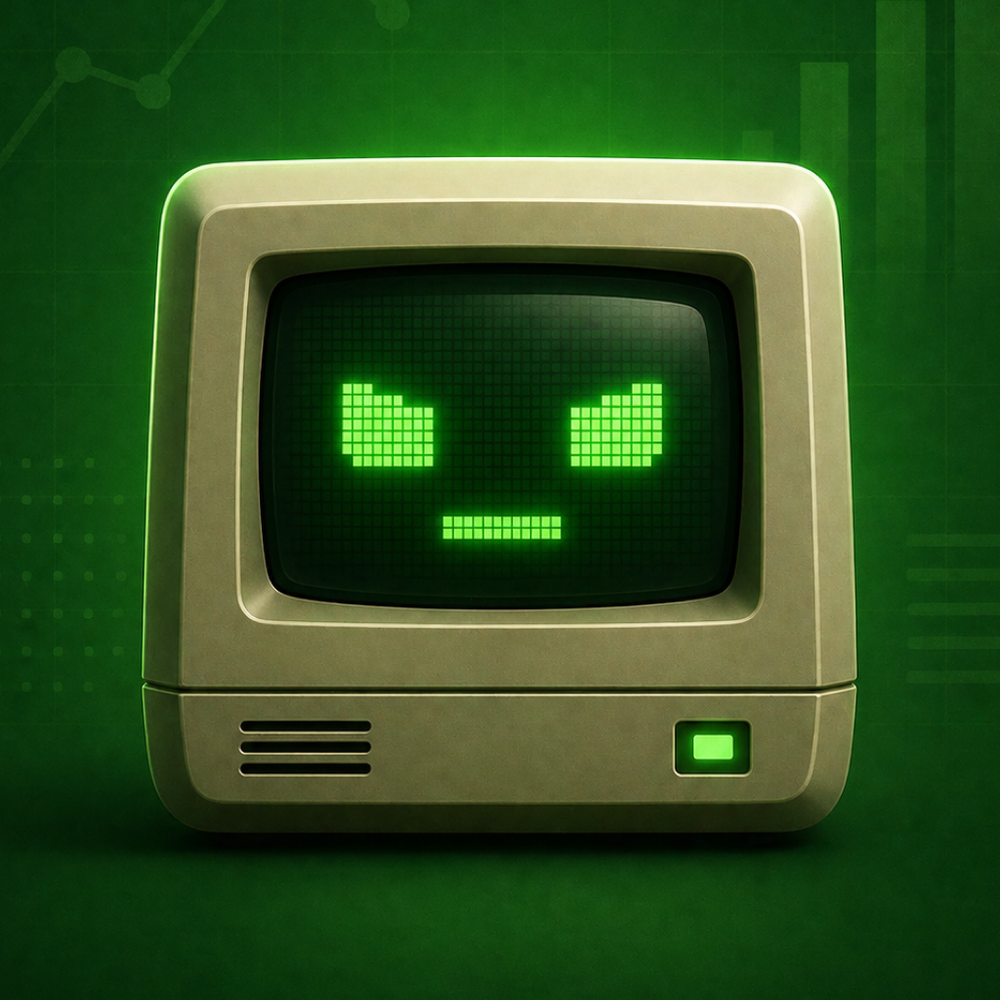

# StatJack

<p align="center">
  
</p>

**Lightweight macOS menu bar system monitor.** Track CPU, RAM, and Network usage at a glance — right from your menu bar.

<p align="center">
  <a href="https://github.com/burakereno/statjack/releases/latest/download/StatJack.dmg">
    
  </a>
  &nbsp;
  <a href="https://github.com/burakereno/statjack/releases/latest">
    
  </a>
</p>

<p align="center">
  <sub>macOS 14.0+ · ~3 MB · See <a href="#installation">Installation</a> for first-launch instructions</sub>
</p>

## Features

- 📊 **Real-time CPU usage** — total usage percentage with user/system split
- 🧠 **Memory monitoring** — used/total RAM with breakdown (active, wired, compressed)
- 🌐 **Network speed** — live upload/download speeds + session totals
- ⚡ **Minimal resource usage** — adaptive polling with hidden metrics skipped while idle
- 🎛️ **Configurable** — toggle which metrics appear in the menu bar
- 🖥️ **Native macOS** — built with SwiftUI + AppKit, runs as a menu bar app

## Screenshots

| Menu Bar | Dashboard |
|----------|-----------|
| CPU, RAM, and Network stats displayed inline in the menu bar | Click to see detailed metrics in a popover |

## Installation

### Download DMG

1. Go to the [Releases](../../releases/latest) page
2. Download **`StatJack.dmg`**
3. Open the DMG and drag **StatJack.app** to your **Applications** folder

### Important: First Launch (Unsigned App)

Since StatJack is not notarized by Apple, macOS will block it on first launch. To fix this, run the following command in Terminal **once** after installing:

```bash
xattr -cr /Applications/StatJack.app
```

Then double-click StatJack to launch it. The app will appear in your menu bar (not in the Dock).

> **Note:** This command removes the quarantine flag that macOS applies to downloaded apps. It's a standard procedure for open-source macOS apps that aren't distributed through the App Store.

## Build from Source

### Requirements

- macOS 14.0+
- Xcode 16.0+
- [XcodeGen](https://github.com/yonaskolb/XcodeGen)

### Steps

```bash
# Clone the repo
git clone https://github.com/AnaEren/statjack.git
cd statjack

# Generate Xcode project
xcodegen generate

# Build
xcodebuild -project StatJack.xcodeproj -scheme StatJack -configuration Release build
```

## Tech Stack

- **SwiftUI** — UI framework
- **AppKit** — NSStatusItem, NSPopover, event monitoring
- **Mach/sysctl** — CPU & memory stats via kernel APIs
- **getifaddrs** — Network throughput monitoring
- **XcodeGen** — Project file generation

## License

MIT License — see [LICENSE](LICENSE) for details.
