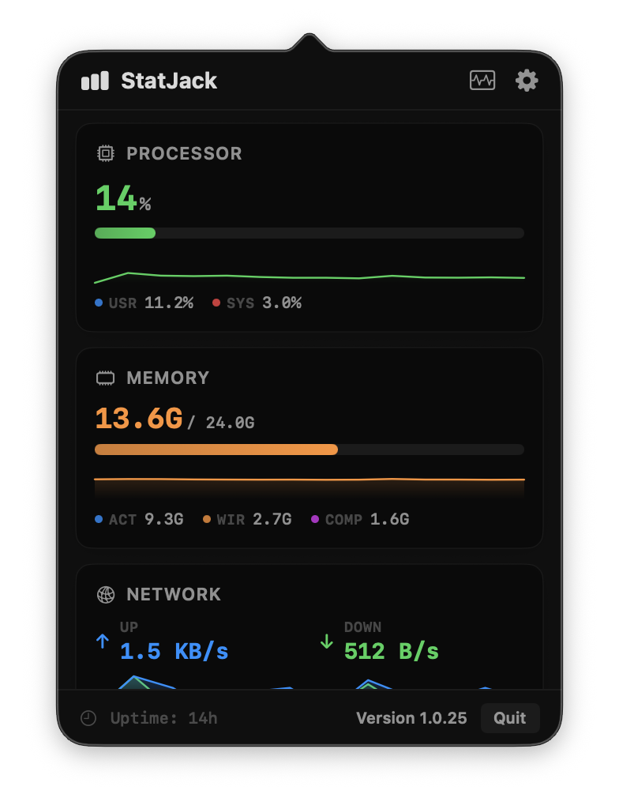
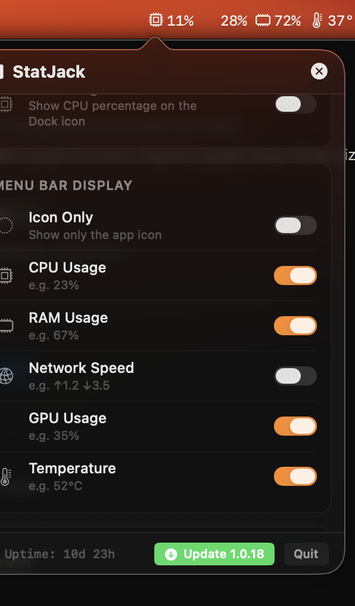

# StatJack

<p align="center">
  
</p>

**Lightweight macOS menu bar system monitor.** Track CPU, RAM, Disk, and Network usage at a glance — right from your menu bar.

<p align="center">
  <a href="https://github.com/burakereno/statjack/releases/latest/download/StatJack.dmg">
    
  </a>
  &nbsp;
  <a href="https://github.com/burakereno/statjack/releases/latest">
    
  </a>
  &nbsp;
  <a href="https://openai.com/codex">
    
  </a>
</p>

<p align="center">
  <sub>macOS 14.0+ · ~3 MB · Developer ID signed and notarized</sub>
</p>

## Features

- 📊 **CPU** — total usage with user/system split
- 🧠 **Memory** — used/total RAM with active / wired / compressed breakdown
- 💾 **Disk** — used/available root volume space with low-frequency polling
- 🌐 **Network** — live upload/download speeds + session totals
- 🎮 **GPU** — utilization via IOAccelerator
- 🌡️ **Thermal state** — public macOS thermal pressure status (normal, elevated, high, critical)
- 📈 **Sparklines** — compact trend lines for live metrics
- 🔔 **Threshold alerts** — macOS notifications when CPU or RAM cross your set %
- 🚀 **Launch at Login** — system Login Items via SMAppService
- ⬇️ **One-click in-app updates** — checks GitHub releases, downloads + installs the new DMG without leaving the app
- ⚡ **Minimal resource usage** — adaptive polling, hidden metrics skipped while idle
- 🖥️ **Native macOS** — SwiftUI + AppKit, runs as a menu bar app

## Screenshots

<p align="center">
  
  &nbsp;&nbsp;
  
</p>

<p align="center">
  <sub>Compact trend lines · GPU + thermal state · Dock badge metric picker · threshold notifications.</sub>
</p>

## Installation

### Download DMG

1. Go to the [Releases](../../releases/latest) page
2. Download **`StatJack.dmg`**
3. Open the DMG and drag **StatJack.app** to your **Applications** folder

Double-click StatJack to launch it. The app is Developer ID signed and notarized, and will appear in your menu bar (not in the Dock).

## Build from Source

### Requirements

- macOS 14.0+
- Xcode 16.0+
- [XcodeGen](https://github.com/yonaskolb/XcodeGen)

### Steps

```bash
# Clone the repo
git clone https://github.com/burakereno/statjack.git
cd statjack

# Generate Xcode project
xcodegen generate

# Build
xcodebuild -project StatJack.xcodeproj -scheme StatJack -configuration Release build
```

## Tech Stack

- **SwiftUI** — UI framework
- **AppKit** — NSStatusItem, NSPopover, event monitoring
- **Mach/sysctl** — CPU & memory stats via kernel APIs
- **getifaddrs** — Network throughput monitoring
- **XcodeGen** — Project file generation

## License

MIT License — see [LICENSE](LICENSE) for details.
